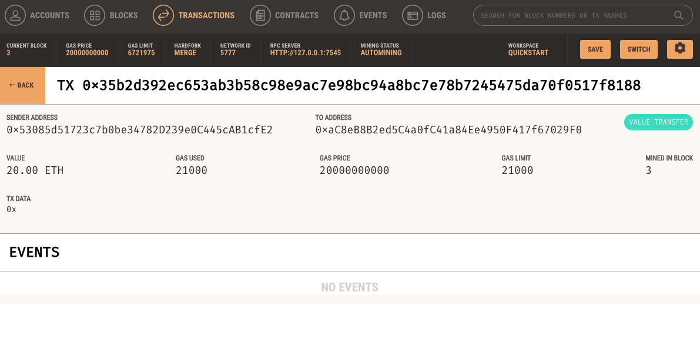

# Module_19_Challenge
## Unit 19 Homework: Cryptocurrency Wallet

### Background
You work at a startup that is building a new and disruptive platform called KryptoJobs2Go. KryptoJobs2Go is an application that its customers can use to find fintech professionals from among a list of candidates, hire them, and pay them. As KryptoJobs2Go’s lead developer, you have been tasked with integrating the Ethereum blockchain network into the application in order to enable your customers to instantly pay the fintech professionals whom they hire with cryptocurrency.

In this Challenge, you will complete the code that enables your customers to send cryptocurrency payments to fintech professionals. To develop the code and test it out, you will assume the perspective of a KryptoJobs2Go customer who is using the application to find a fintech professional and pay them for their work.

Now it's time to put it all together and test the KryptoJobs2Go application with your newly integrated Ethereum wallet. You will send a test transaction by using the application’s web interface, and then look up the resulting transaction in Ganache. To do so, complete the following steps:

1. From your terminal, navigate to the project folder that contains your `.env` file and the `krypto_jobs.py` and `crypto_wallet.py` files. Be sure to activate your Conda `dev` environment if it is not already active.

2. To launch the Streamlit application, type `streamlit run krypto_jobs.py`.

3. On the resulting webpage, select a candidate that you would like to hire from the appropriate drop-down menu. Then, enter the number of hours that you would like to hire them for. (Remember, you do not have a lot of ether in your account, so you cannot hire them for long!)

4. Click the Send Transaction button to sign and send the transaction with your Ethereum account information. Navigate to the Transactions section of Ganache.

    * Take a screenshot of your address balance and history on Ganache. Save this screenshot to the README.md file of your GitHub repository for this Challenge assignment.

    * Take a screenshot of the transaction details on Ganache. Save this screenshot to the README.md file of your GitHub repository for this Challenge assignment.

5. Return to the original transaction, and click the transaction’s To address.

* Take a screenshot of the recipient’s address balance and history from your Ganache application. Save this screenshot to the README.md file of your GitHub repository for this Challenge assignment.

